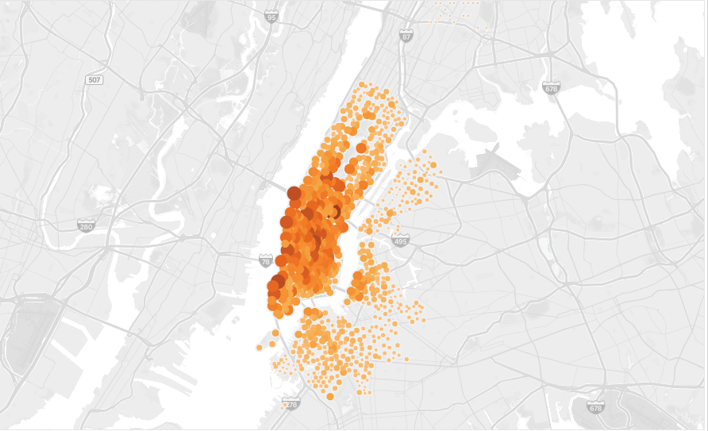
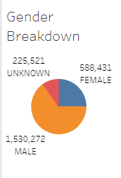
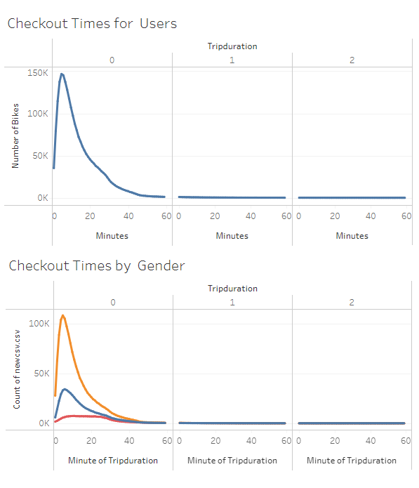

# NYC CitiBike

## Project Overview

Using CitiBike data from New York City, analysis and visualizations were created to assist in determining if this business model would be successful in Des Moines, Iowa.

## Resources

### Data Sources 

201908-citibike-tripdata

### Software 

* Tableau
* Jupyter Notebook

## Results

New York City’s bike data shows a heavy concentration on Manhattan Island, this is possibly indicating that the bikes were primarily used for tourist and sight-seeing purposes.

The breakdown of usage by gender shows that users are mostly male by a wide margin:

The gender of the user does not seem to have an effect on the duration of use as all gender categories stayed mostly within a range of 0 to 30 minutes.

Within the Tableau story, further visualizations show how gender affects when users trended towards using the bikes, with male users utilizing the bikes more on weekdays at rush hour times, and females showing more concentrated use on the weekends.

[Link to dashboard](https://public.tableau.com/views/NYC-CitiBike_16375484914270/NYCCitiBike?:language=en-US&:display_count=n&:origin=viz_share_link)

## Summary

The New York City CitiBike data shows the business model works in an area with a high tourist and commuter population. The business likely saw success as those two needs are in a very concentrated area in New York City.

The bikes are also primarily used by male users, additional information on the commuter population and tourist population of Des Moines would be needed to forecast potential success.

An additional visualization that would give a more complete analysis would be the trip distance to see how the distance bikes are ridden in New York City would compare to possible distances in Des Moines.

It would also be useful to see a graph showing the number of trips users took within a day. If a user took 1-2 trips, that could be indicative of a commuter. If 3 or more trips were taken in a day, that would possibly represent more of a tourist visiting multiple locations. This would help give insight to the purpose of use. 
